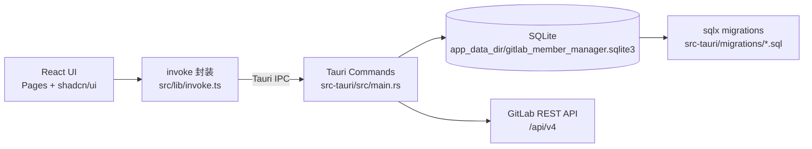
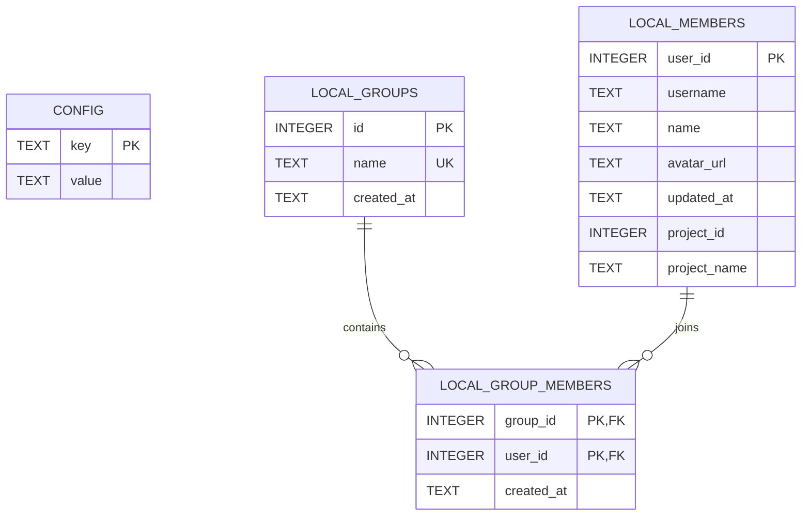
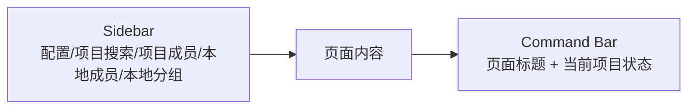
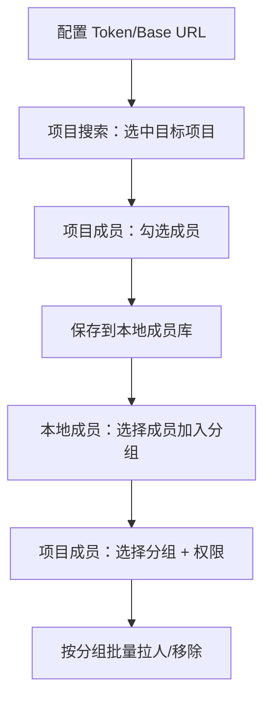
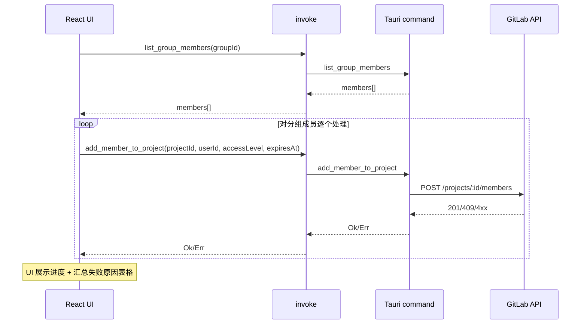

# GitLab Member Manager

一个面向**日常运维/交付场景**的 GitLab 项目成员管理桌面工具（Tauri 2 + React 18 + Rust + SQLite）。

- **一键批量拉人/移除**：基于“本地虚拟分组”，把一套人员名单快速同步到不同项目
- **可追溯/可复用**：成员名单与分组关系落地到本地 SQLite，跨项目复用
- **对失败更友好**：批量操作逐个调用 API，汇总**成功/失败明细**，不会“一个失败全盘中断”
- **桌面端体验**：命令栏 + 侧边栏导航 + 统一面板布局，适合频繁操作

---

## 亮点速览

- **跨项目复用的“本地虚拟分组”**：先把成员保存到本地，再维护分组，再一键对项目执行批量拉人/移除。
- **批量拉人进度对话框**：实时进度、当前用户、失败原因表格，便于定位权限/Token/成员状态问题。
- **安全日志**：前端 `invoke` 包装对敏感字段（如 `token`）做脱敏；后端也记录关键链路日志并写入滚动文件。
- **Windows SQLite 连接兼容性处理**：后端连接串把 `\` 替换为 `/`，避免 Windows 路径转义导致连接失败。

---

## 整体设计（Architecture）

### 分层结构



### “为什么这样设计”

- **前端只做交互与展示**：不直接碰网络与 DB，所有能力通过 `invoke` 调用后端命令，天然隔离敏感操作。
- **后端集中做三件事**：
  - **配置管理**：Base URL / Token 持久化（SQLite `config` 表），启动自动加载
  - **GitLab API 访问**：项目搜索、成员列表、加人、移除
  - **本地成员库/分组库**：本地复用名单 + 分组关系管理

---

## 功能设计（Features）

### 功能清单（按页面）

- **配置（Settings）**
  - 保存/读取 GitLab Base URL 与 Private Token（持久化到 SQLite）
- **项目搜索（Projects）**
  - 关键字搜索项目（分页）
  - 点击行选择项目（在顶部命令栏展示当前项目）
- **项目成员（Members）**
  - 选择项目后分页查看成员（含 access level、过期时间）
  - 多选成员 → **保存到本地成员库**
  - 选择本地分组 + 权限（可选过期时间）→ **按分组批量拉人**
  - 多选成员 → **批量移除所选**
  - 选择分组 → **按分组批量移除**
- **本地成员（Local Members）**
  - 本地成员分页 + 搜索
  - 多选成员 → 加入本地分组
  - 多选成员 → 从本地库删除（关联表级联清理）
- **本地分组（Groups）**
  - 创建/编辑/删除分组
  - 查看分组成员 + 过滤 + 分页
  - 从分组移除成员

---

## 数据设计（SQLite 表设计）

### ER 图



### 表说明

- **`config`**
  - **用途**：保存 GitLab 配置（单行/固定 key）
  - **字段**
    - `key`：主键（目前固定为 `gitlab`）
    - `value`：JSON 字符串（例如：`{"base_url":"...","token":"..."}`）

- **`local_members`**
  - **用途**：本地成员库（以 GitLab `user_id` 去重）
  - **字段**
    - `user_id`：GitLab 用户 ID（PK）
    - `username` / `name` / `avatar_url`：展示用
    - `updated_at`：本地入库/更新的时间
    - `project_id` / `project_name`：该成员最初从哪个项目保存而来（便于追溯）

- **`local_groups`**
  - **用途**：本地虚拟分组（用于批量拉人/移除）
  - **字段**：`id`（自增）、`name`（唯一）、`created_at`

- **`local_group_members`**
  - **用途**：分组与成员的多对多关系
  - **关键点**
    - 复合主键 `(group_id, user_id)`，避免重复加入
    - 外键 **ON DELETE CASCADE**：删除分组或本地成员时，关联自动清理

### 迁移文件

- `src-tauri/migrations/0001_init.sql`：创建 `local_members` / `local_groups` / `local_group_members`
- `src-tauri/migrations/0002_config.sql`：创建 `config`
- `src-tauri/migrations/0003_local_members_project.sql`：为 `local_members` 增加 `project_id` / `project_name`

---

## 交互设计（UX / Flow）

### 全局导航与“当前项目”提示

- 左侧 **Sidebar** 负责页面切换
- 顶部 **Command Bar** 展示当前页面标题，并在已选项目时展示“当前项目 + #ID”



### 主流程：从“人”到“分组”再到“项目”



### 批量拉人（逐个执行 + 汇总结果）



---

## 使用指南（开发/运行/打包）

### 前置依赖

- Node.js 18+（推荐 20+）
- pnpm
- Rust toolchain（stable）
- 各平台 Tauri 依赖（Windows 需要 WebView2）

### 本地开发

```bash
pnpm install
pnpm tauri dev
```

### 运行后数据存储位置

- **SQLite**：首次启动自动创建在 Tauri 的 `app_data_dir` 下，文件名为 `gitlab_member_manager.sqlite3`
- **日志**：同目录下 `logs/`，按天滚动，最多保留 7 天

### 使用步骤（推荐顺序）

1. **配置**：填写 GitLab Base URL（例如 `https://gitlab.example.com`）和 Private Token，点击保存
2. **项目搜索**：搜索并点击项目行，确认顶部显示“当前项目”
3. **项目成员**：
   - 勾选成员 → 点击“保存所选到本地成员”（建立本地成员库）
   - 或直接选择分组 → 执行按分组批量拉人/移除
4. **本地成员**：从本地库筛选成员 → 加入分组
5. **本地分组**：维护分组名称/成员；必要时删除分组

### 打包（Windows）

项目 `src-tauri/tauri.conf.json` 已开启 bundle，并配置了 `msi` / `nsis` 目标与中文安装语言。

```bash
pnpm tauri build
```

---

## 接口设计（Tauri Commands / GitLab API）

### Tauri Commands（前端可调用能力）

- **配置**
  - `get_gitlab_config`
  - `set_gitlab_config(base_url, token)`
- **GitLab**
  - `search_projects(keyword, page, per_page)`
  - `list_project_members(project, page, per_page)`
  - `add_member_to_project(project, user_id, access_level, expires_at?)`
  - `batch_add_members_to_project(project, user_ids, access_level, expires_at?)`
  - `batch_remove_members_from_project(project, user_ids)`
- **本地成员/分组**
  - `upsert_local_members(members[])`
  - `list_local_members(query?, page, per_page)`
  - `delete_local_members(user_ids[])`
  - `create_local_group(name)`
  - `list_local_groups()`
  - `update_local_group(id, name)`
  - `delete_local_group(id)`
  - `add_members_to_group(group_id, user_ids[])`
  - `remove_members_from_group(group_id, user_ids[])`
  - `list_group_members(group_id)`

### GitLab API 使用约定

- 使用 Header：`PRIVATE-TOKEN: <token>`
- 项目 ID 与 `path_with_namespace` 都可作为项目标识（本项目实现里：成员接口以 `project id` 为主）
- 对 `409 Conflict`（成员已存在）与 `404 Not Found`（移除时用户不存在）做了“视作成功”的兼容处理

---

## 安全与注意事项

- **Token 存储**：当前版本将 token 以明文保存到本地 SQLite（`config.value` JSON）。若要更强安全性，可改用系统 Keychain/Windows Credential Manager（后续可扩展）。
- **日志脱敏**：前端 `invoke` 对包含 `token` 等敏感字段的参数做脱敏输出；建议不要把日志上传到公开渠道。
- **权限要求**：Token 需要具备调用成员相关 API 的权限（通常需要 `api` scope）。

---

## 测试

项目使用 Vitest（部分 UI 组件/冒烟测试位于 `src/__tests__` 与 `src/components/ui/__tests__`）。

```bash
pnpm test
```

---

## 技术栈

- **UI**：React 18 + TailwindCSS v4 + shadcn/ui + Radix UI
- **桌面容器**：Tauri 2
- **后端**：Rust（reqwest + sqlx + tracing）
- **本地存储**：SQLite（migrations 管理）


